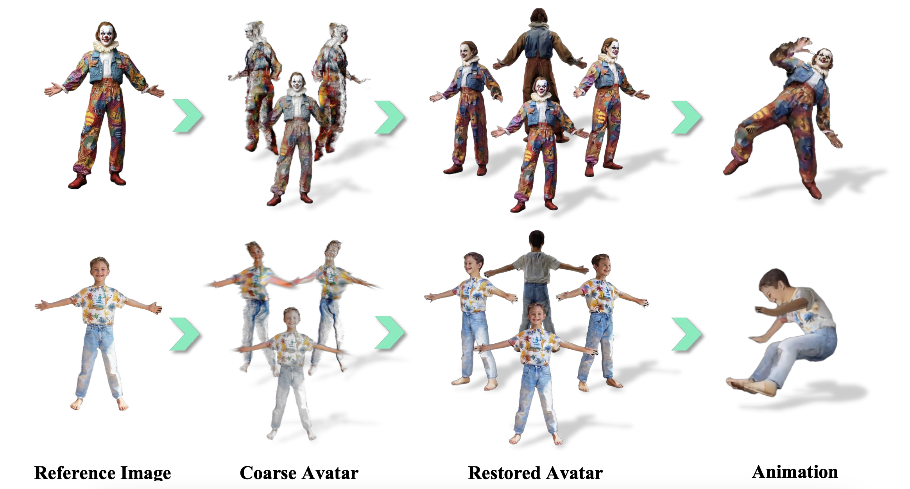
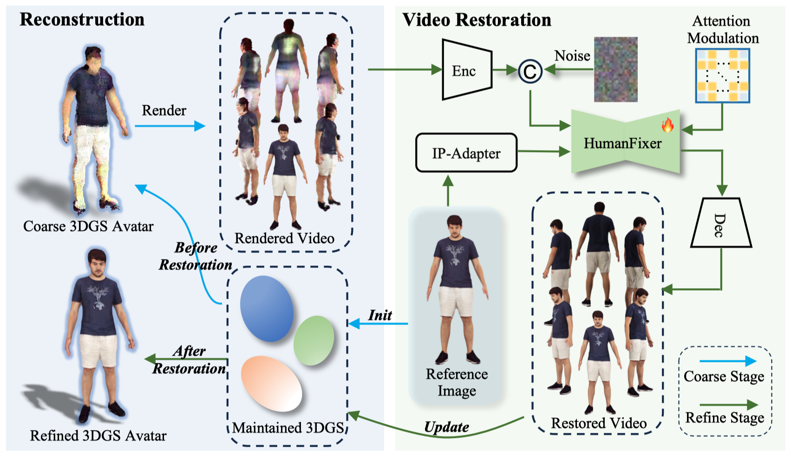

<div align="center">   
  
# HumanDreamer-X: Photorealistic Single-image Human Avatars Reconstruction via Gaussian Restoration

</div>

 
## [Project Page](https://humandreamer-x.github.io/) | [Paper]()


# News
- **[2025/4/5]** Repository Initialization.

## Abstract
Single-image human reconstruction is vital for digital human modeling applications but remains an extremely challenging task. Current approaches rely on generative models to synthesize multi-view images for subsequent 3D reconstruction and animation. However, directly generating multiple views from a single human image suffers from geometric inconsistencies, resulting in issues like fragmented or blurred limbs in the reconstructed models.
To tackle these limitations, we introduce HumanDreamer-X, a novel framework that integrates multi-view human generation and reconstruction into a unified pipeline, which significantly enhances the geometric consistency and visual fidelity of the reconstructed 3D models. In this framework, 3D Gaussian Splatting serves as an explicit 3D representation to provide initial geometry and appearance priority. Building upon this foundation, HumanFixer is trained to restore 3DGS renderings, which guarantee photorealistic results.
Furthermore, we delve into the inherent challenges associated with attention mechanisms in multi-view human generation, and propose an attention modulation strategy that effectively enhances geometric details identity consistency across multi-view.
Experimental results demonstrate that our approach markedly improves generation and reconstruction PSNR quality metrics by 16.45% and 12.65%, respectively, achieving a PSNR of up to 25.62 dB, while also showing generalization capabilities on in-the-wild data and applicability to various human reconstruction backbone models.

## Method Overview

Overall framework of the proposed HumanDreamer-X. The process begins by initializing a coarse 3DGS avatar using a reference image. 
A rendered video serves as a guide, providing geometric and appearance priors. 
Subsequently, HumanFixer performs video restoration, wherein an attention modulation is employed to enhance video consistency. 
Throughout this process, the restored video is used to continuously update the 3DGS model, ultimately resulting in a refined 3DGS avatar.




<!-- ## BibTeX

```bibtex
@article{wang2025humandreamer,
  title={HumanDreamer: Generating Controllable Human-Motion Videos via Decoupled Generation}, 
  author={Boyuan Wang and Xiaofeng Wang and Chaojun Ni and Guosheng Zhao and Zhiqin Yang and Zheng Zhu and Muyang Zhang and Yukun Zhou and Xinze Chen and Guan Huang and Lihong Liu and Xingang Wang},
  journal={arXiv preprint arXiv:2503.24026},
  year={2025}
} -->